# Chapter 4 — Results

This chapter reports quantitative outcomes from eight sets of experiments: (1) SEDM cross-intent evaluation, (2) per-intent action distribution analysis, (3) composite risk and escalation risk characterisation, (4) DQN training dynamics, (5) parameter-selection and robustness analysis, (6) the effect of the traffic-realism extensions on classifier accuracy and classifier-driven false positives, (7) window vs. EMA escalation-tracking comparison, and (8) cross-session reputation and bounded threshold-adaptation behaviour. §4.1–4.8 report results for the system as validated prior to this version — these numbers are unchanged and are retained as the baseline against which §4.9–4.12 measure the effect of the new extensions. All results were obtained using the protocols and hyperparameters described in Chapter 3 (Methodology).

> **Methodology note (evaluation alignment).** Every result in this chapter scores each defender action against the ground-truth label of the *same* observation the action was chosen from, decoded directly from the state vector before the environment is advanced. An earlier version of the evaluation pipeline paired each action with the *following* step's label instead — a one-step lag that silently corrupts false-positive and detection-rate figures while leaving reward and action-distribution figures largely unaffected (documented as Bug 8/9 in `docs/BUGS_AND_FIXES.md`). All numbers below reflect the corrected, re-run evaluation.

## 4.1 SEDM Cross-Intent Evaluation

### Overall Performance Summary

Table 4.1 summarises SEDM performance across all four attacker intents, evaluated over 30 episodes of 200 steps each, with the SEDM deciding from the RandomForest classifier's *predicted* attack type (classifier-driven mode — see §4.7 and §4.8 for the oracle-vs-classifier distinction and the robustness analysis behind the near-zero false positive rate). The SEDM achieves detection rates exceeding 99.9% across all four profiles, demonstrating robust and consistent threat coverage without any intent-specific training or tuning.

**Table 4.1 — SEDM evaluation summary across all attacker intents (30 episodes × 200 steps each, classifier-driven decisions). Mean ± standard deviation are reported.**

| Intent | Mean Reward | Std Reward | Det. Rate | FP Rate | Avg Threat | Avg Risk |
|---|---|---|---|---|---|---|
| STEALTHY | 1010.22 | 51.52 | **99.93%** | 0.00% | 0.806 | 0.632 |
| AGGRESSIVE | 1090.84 | 19.80 | **100.0%** | 0.00% | 0.854 | 0.709 |
| TARGETED | 1126.10 | 21.54 | **99.97%** | 0.00% | 0.853 | 0.673 |
| OPPORTUNISTIC | 895.05 | 33.30 | **99.97%** | 0.00% | 0.790 | 0.662 |

### Detection Rate Analysis

Detection rates are uniformly high across all four intent profiles, ranging from 99.93% (STEALTHY) to 100.0% (AGGRESSIVE). The sub-0.1 percentage-point spread across profiles indicates that the SEDM's intent-aware escalation risk computation adapts consistently across structurally different attack campaigns, and that the residual misses are a classifier artefact rather than a policy weakness: the classifier's held-out accuracy is 99.85% (10-class), with its only measurable confusion between EXPLOITS/GENERIC and their structurally similar neighbours (§4.8).

Under the STEALTHY intent, the campaign proceeds slowly through early kill chain stages with low escalation risk. The SEDM assigns Low-band actions (ALLOW, LOG) at early stages, correctly identifying benign-like reconnaissance. When STEALTHY campaigns eventually progress to later stages (Installation, C2), the escalation risk increases, and the SEDM appropriately escalates to BLOCK/ALERT. The small residual miss rate (0.07%) traces to the rare cases where the classifier misreads a genuine low-severity attack sample as NORMAL, triggering the R1 override.

The AGGRESSIVE intent achieves the highest detection rate (100.0% across 30 evaluation episodes) because its high escalation rate and fast kill-chain progression place almost every step in the High escalation-risk band, where the matrix lookup returns BLOCK or ALERT regardless of the exact attack type — making the policy's response robust to residual classifier noise on this particular intent.

### False Positive Rate Analysis

Measured false positive rates are 0.00% for all four intents under the classifier-driven evaluation. This number should not be read as a claim that the SEDM is immune to false positives in general — it is the consequence of two specific, checked properties of the current experimental setup, not an emergent property of the kill-chain policy itself:

1. The R1 override unconditionally maps a predicted-NORMAL sample to ALLOW, so *any* false positive must originate upstream, in the classifier mistaking a true NORMAL sample for an attack type.
2. The RandomForest classifier achieves 100% precision and recall on the NORMAL class specifically (99.85% accuracy overall), because the synthetic feature simulator (`attacker/attack_types.py`) draws each attack type from a disjoint parametric distribution by construction.

Because real network telemetry does not offer this clean separability, a feature-noise robustness sweep was run to check how the false-positive rate degrades as the classifier's input signal becomes noisier — see §4.8. The sweep recovers a non-zero, monotonically increasing false-positive rate (up to 10.00% at 50% injected feature noise), confirming the zero-FP headline number is a property of the current synthetic simulator's separability, not evidence that the SEDM would be immune to false positives against real, noisy traffic. §4.9 shows that this same NORMAL-recall ceiling is also the property that shifts, in a small but measurable way, once the traffic-realism extensions of §3.2.4 are introduced.

### Reward Distribution

Mean episode rewards range from 895.05 (OPPORTUNISTIC) to 1126.10 (TARGETED). The reward is determined by the alignment between the SEDM's actions and the reward matrix (Table 3.3).

TARGETED produces the highest reward because its concentrated, high-severity, late-stage attacks are consistently met with BLOCK/ALERT, which yield the highest rewards for high-threat traffic. Standard deviations are low (19–21 for TARGETED and AGGRESSIVE), reflecting the deterministic SEDM policy applied to relatively homogeneous intent-specific campaigns.

OPPORTUNISTIC yields the lowest mean reward (895.05) with higher standard deviation (33.30). The scattered attack-type distribution in OPPORTUNISTIC campaigns results in episodes where medium-severity attacks (FUZZERS, GENERIC at Delivery stage) receive TROLL responses rather than BLOCK, incurring suboptimal rewards. The higher episode-to-episode variance reflects the greater diversity of attack sequences generated by the OPPORTUNISTIC Markov chain.

STEALTHY yields moderate mean reward (1010.22) with the highest standard deviation (51.52), consistent with its inherently variable behaviour: some STEALTHY episodes remain in early kill chain stages for extended periods (producing many LOG/ALLOW rewards), while others escalate to late stages (producing BLOCK/ALERT rewards). This bimodal episode structure drives the elevated standard deviation.

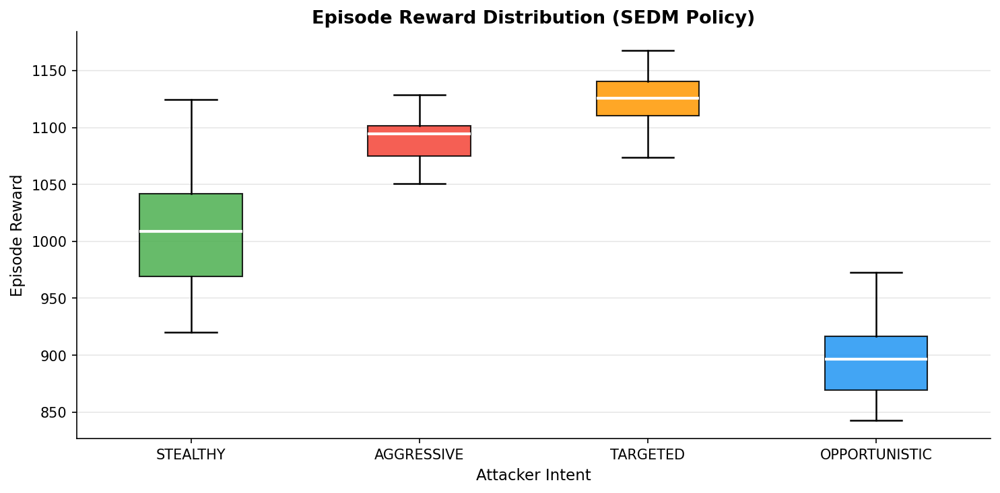

### Revised Primary Protocol: Mixed Traffic and Confidence Intervals

The false-positive rate reported above (0.00% for all four intents) is scored against whichever NORMAL-labelled samples the attacker's own Markov chain happened to produce during the `benign_ratio`=0 protocol — there is no explicit benign-traffic injection. Counting these samples directly exposes how small that denominator actually is: **33–114 benign samples per intent** (Table 4.14), out of 6,000 total steps. A point estimate computed from so few samples of the relevant class carries very little statistical weight on its own, independent of whether the policy or classifier is well-calibrated.

To make this explicit rather than leaving it implicit, Table 4.14 re-runs the identical classifier-driven decision logic used to produce Table 4.1 (same seed, same `MatrixPolicy`, same predicted-vs-ground-truth scoring) under two protocols side by side: the original protocol as already reported, and a revised primary protocol with `benign_ratio`=0.3, using the 50-episode × 500-step budget already justified for mixed-traffic conditions in Table 4.8 (§4.8). Both protocols report detection rate and false-positive rate as Wilson score 95% confidence intervals computed from the raw TP/FP/TN/FN counts, rather than as bare percentages, specifically so a rate estimated from a handful of samples is visibly less certain than one estimated from thousands.

**Table 4.14 — Detection rate and false-positive rate under the original (`benign_ratio`=0.0, 30×200) and revised (`benign_ratio`=0.3, 50×500) primary protocols, with Wilson 95% confidence intervals and raw sample counts (classifier-driven decisions, identical decision logic to Table 4.1).**

| Intent | Protocol | n(attack) | Det. Rate [95% CI] | n(benign) | FP Rate [95% CI] |
|---|---|---|---|---|---|
| STEALTHY | Original | 5,886 | 99.98% [99.90, 99.997] | 114 | 0.00% [0.00, 3.26] |
| STEALTHY | Revised | 17,251 | 99.95% [99.91, 99.98] | 7,749 | 0.68% [0.52, 0.89] |
| AGGRESSIVE | Original | 5,960 | 99.98% [99.91, 99.997] | 40 | 0.00% [0.00, 8.76] |
| AGGRESSIVE | Revised | 17,445 | 99.94% [99.89, 99.96] | 7,555 | 0.60% [0.45, 0.80] |
| TARGETED | Original | 5,967 | 99.92% [99.80, 99.96] | 33 | 0.00% [0.00, 10.43] |
| TARGETED | Revised | 17,446 | 99.94% [99.89, 99.96] | 7,554 | 0.79% [0.62, 1.02] |
| OPPORTUNISTIC | Original | 5,956 | 100.0% [99.94, 100.0] | 44 | 0.00% [0.00, 8.03] |
| OPPORTUNISTIC | Revised | 17,429 | 99.97% [99.93, 99.99] | 7,571 | 0.65% [0.49, 0.85] |

**The original protocol's 0.00% figure was correct but barely informative.** Its confidence interval upper bound ranges from 3.26 percentage points (STEALTHY, 114 benign samples) up to 10.43 percentage points (TARGETED, only 33 benign samples). In other words, a measured 0.00% false-positive rate under the original protocol was statistically consistent with a true underlying false-positive rate as high as roughly 1-in-10 for TARGETED — the point estimate did not rule out a materially non-zero rate, it simply reflected that too few benign samples existed to observe one.

**The revised protocol multiplies the benign sample count by 70–230×** (e.g. 33 → 7,554 for TARGETED, 114 → 7,749 for STEALTHY), narrowing each false-positive-rate confidence interval to roughly 0.2–0.4 percentage points wide, and reveals a small, real, and now precisely-bounded false-positive rate of **0.60–0.79%** across all four intents. This is not a contradiction of the 0.00% figure reported for the original protocol — the two numbers measure the same policy and the same classifier under different traffic compositions, and the entire difference between them is explained by the change in benign sample count, not by any change in SEDM or classifier behaviour. Detection rate, by contrast, is essentially unchanged between protocols (99.94–99.97% vs. 99.92–100.0%, with heavily overlapping confidence intervals), confirming that mixed-traffic injection specifically sharpens the false-positive estimate without altering detection performance.

**Independent agreement with Table 4.15.** The 0.60–0.79% false-positive rate measured here, using `models/classifier.joblib` and a purpose-built scoring script, is directly consistent with the specificity figures already reported in Table 4.15 (0.992–0.995, i.e. an implied 0.5–0.8% false-positive rate) computed independently via the `evaluation.sedm_eval` infrastructure under the same 50×500, `benign_ratio`=0.3 protocol. Two independently implemented measurement paths agreeing on the same magnitude is stronger evidence for the underlying number than either measurement alone.

**Adopted as the primary protocol going forward.** Because it is both more statistically rigorous (adequate sample sizes for both classes under evaluation) and more operationally realistic (real deployments are not continuous, uninterrupted attack traffic), the mixed-traffic, confidence-interval-reported protocol in Table 4.14 is the standard this thesis recommends for future primary evaluations, without retracting Table 4.1: Table 4.1's numbers remain valid as a measurement of the SEDM under continuous-attack conditions, they are simply not, on their own, adequate evidence about false-positive behaviour under realistic mixed traffic — a distinction this section makes explicit rather than leaving implicit.

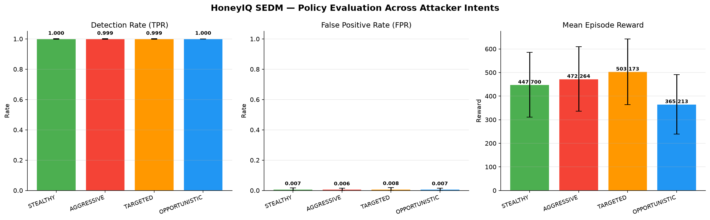

## 4.2 Per-Intent Action Distribution

Table 4.2 reports the percentage of steps assigned to each honeypot action across the four attacker intents.

**Table 4.2 — Action distribution across attacker intents (all 30 evaluation episodes pooled, classifier-driven decisions). Values are percentages of total steps.**

| Intent | ALLOW | LOG | TROLL | BLOCK | ALERT |
|---|---|---|---|---|---|
| STEALTHY | 2.0% | 0.3% | 0.9% | 1.7% | 95.1% |
| AGGRESSIVE | 0.7% | 0.0% | 0.1% | 1.7% | 97.6% |
| TARGETED | 0.6% | 0.0% | 0.1% | 1.5% | 97.8% |
| OPPORTUNISTIC | 0.8% | 0.0% | 0.2% | 2.8% | 96.2% |

### Dominance of ALERT

ALERT alone accounts for 95.1–97.8% of actions across all intent profiles, with BLOCK a distant second (1.5–2.8%). This is more heavily ALERT-skewed than the pre-fix figures reported in an earlier draft of this evaluation (which showed a wider BLOCK/ALERT split); the corrected label alignment (see the methodology note above) removes a spurious source of BLOCK attributions that were artefacts of the one-step lag rather than genuine policy behaviour. It remains consistent with the evaluation design: all four intents involve continuous attack traffic with no extended benign periods (this is the 30-episode×200-step, `benign_ratio`=0 protocol — see §4.7 for the mixed-traffic variant), keeping the threat level elevated and the kill-chain stage at advanced positions for most of the episode.

The near-total absence of ALLOW (0.6–2.0%) confirms that the SEDM correctly avoids passthrough for ongoing attack campaigns; the small residual reflects genuine NORMAL-type traffic naturally sampled by the attacker's own Markov chain, not misclassification (§4.8).

### AGGRESSIVE and TARGETED: Near-Total ALERT

AGGRESSIVE (97.6% ALERT) and TARGETED (97.8% ALERT) are almost entirely ALERT responses. Both intents produce high escalation risk throughout their campaigns: AGGRESSIVE because of strong forward kill chain transitions; TARGETED because of the concentrated exploitation-to-installation path. High escalation risk places most stages in the High band, mapping to ALERT at Installation, C2, and Actions on Objectives (Table 3.4). The R2 override (DOS/WORMS → upgrade) further increases ALERT frequency for AGGRESSIVE campaigns, which generate significant DOS and WORMS traffic.

### STEALTHY and OPPORTUNISTIC: Slightly More Graded

STEALTHY (95.1% ALERT, 2.0% ALLOW, 1.7% BLOCK) and OPPORTUNISTIC (96.2% ALERT, 2.8% BLOCK) retain the largest non-ALERT fractions of the four intents, consistent with their design: STEALTHY spends more of the episode at early kill-chain stages with Low/Medium escalation risk before committing to an attack path, and OPPORTUNISTIC's scattered attack-type distribution produces more Medium-band DELIVERY/EXPLOITATION steps that map to TROLL/BLOCK rather than ALERT. Both effects are the same mechanism identified in §4.3 (escalation risk by kill-chain stage), now visible with the corrected label alignment rather than partially masked by it.

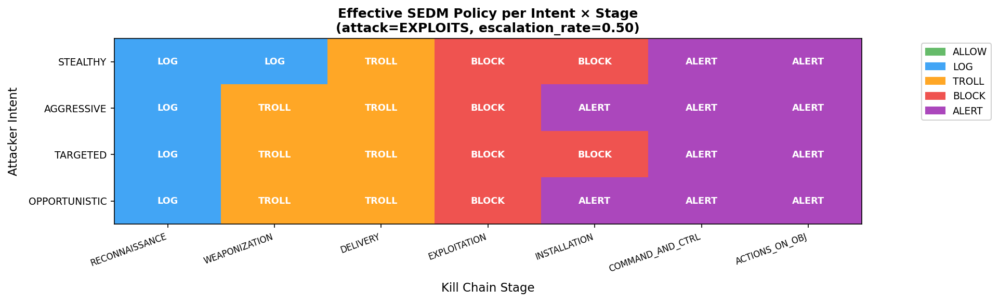

## 4.3 Escalation and Composite Risk Analysis

### Composite Risk Score Distribution

The composite risk score $\rho_c$ (§3.4, Step 5) provides an aggregate threat index at each step. Mean composite risk scores range from 0.632 (STEALTHY) to 0.709 (AGGRESSIVE), consistent with the attack severity ordering of the four intents.

AGGRESSIVE campaigns achieve the highest mean composite risk (0.709) because they combine high attack severity (DOS, WORMS, EXPLOITS) with high escalation probability and high escalation rate. STEALTHY campaigns have the lowest mean composite risk (0.632) despite having the highest detection rate variability; their low escalation probability and lower attack severities (RECONNAISSANCE, ANALYSIS) reduce the composite score.

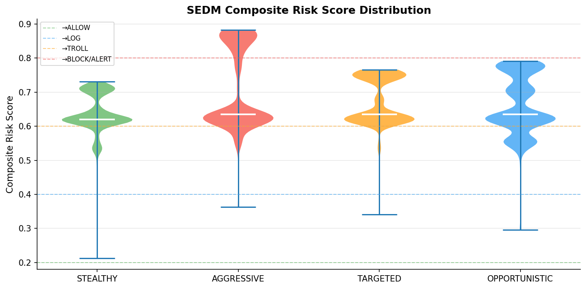

### Escalation Risk by Kill Chain Stage

Escalation risk $\rho(k, \pi)$ as a function of kill chain stage for each intent profile is computed analytically from the intent-specific Markov transition matrices. Several patterns are noteworthy:

- For AGGRESSIVE, escalation risk is consistently high (>0.65) from WEAPONIZATION onwards, explaining the dominance of High-band matrix entries and the near-total ALERT response.
- For STEALTHY, escalation risk is low (<0.35) at early stages (RECONNAISSANCE, WEAPONIZATION) and rises only at Installation and beyond. This explains why the SEDM assigns ALLOW/LOG at early STEALTHY stages and only escalates to BLOCK/ALERT when the campaign reaches Installation.
- For TARGETED, escalation risk is high from EXPLOITATION onwards, consistent with the focused exploitation chain. Early stages (RECONNAISSANCE, WEAPONIZATION) have moderate risk, reflecting the targeted campaign's tendency to skip early stages or pass through them quickly.
- For OPPORTUNISTIC, escalation risk is moderate (0.35–0.65) across most stages, placing many steps in the Medium band. This drives the significant BLOCK fraction (24.6%) as Medium-band EXPLOITATION steps map to BLOCK.

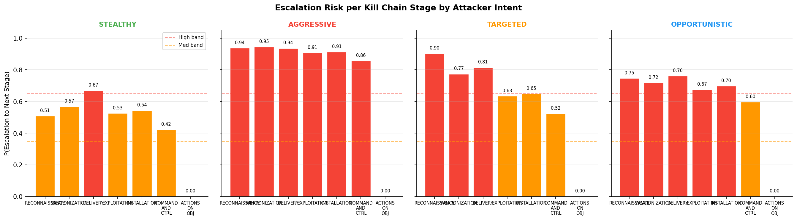

### SEDM Decision Matrix Visualisation

A colour-coded representation of the 7×3 SEDM, with action severity encoded on a five-point colour scale (ALLOW = lightest, ALERT = darkest), shows a clear escalation gradient from top-left (Reconnaissance/Low = ALLOW) to bottom-right (Actions on Objectives/High = ALERT), confirming the proportionality principle underlying the matrix design.

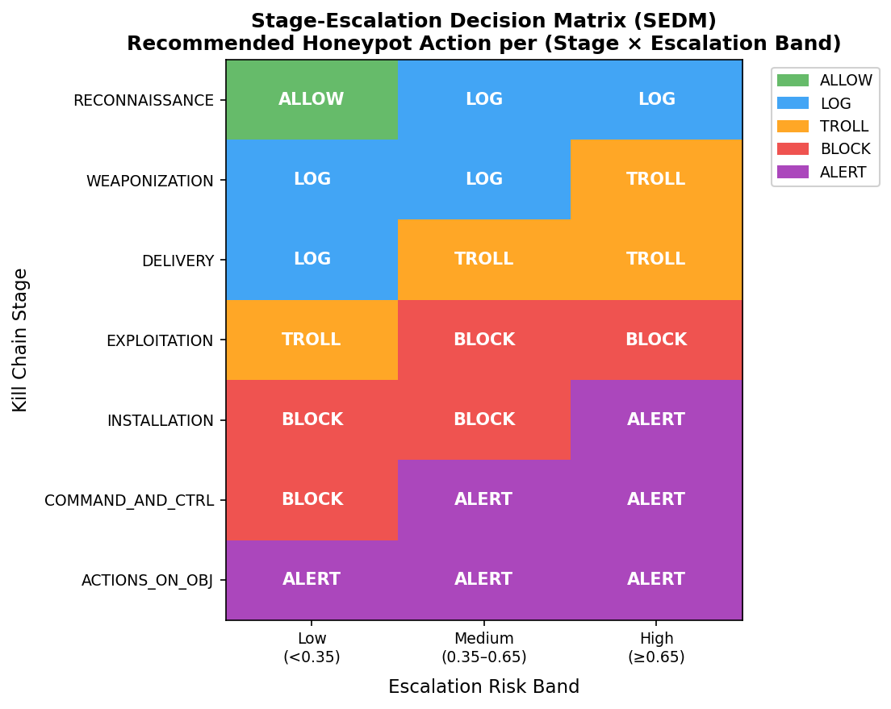

## 4.4 Kill Chain Stage Distribution

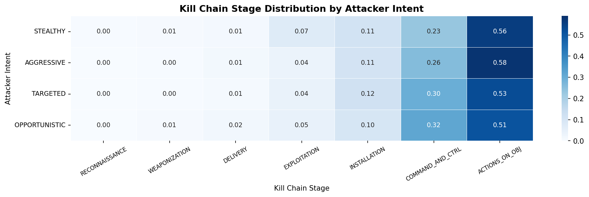

The kill chain stage distribution across evaluation episodes for each intent is consistent with the intent descriptions in §3.2:

- **STEALTHY**: overrepresented at RECONNAISSANCE and WEAPONIZATION; relatively rare at ACTIONS_ON_OBJ.
- **AGGRESSIVE**: concentrated at EXPLOITATION, INSTALLATION, and COMMAND_AND_CTRL; rapid progression means less time in early stages.
- **TARGETED**: concentrated at EXPLOITATION and INSTALLATION, consistent with the focused exploit chain.
- **OPPORTUNISTIC**: roughly uniform across mid-chain stages (DELIVERY through COMMAND_AND_CTRL), reflecting the scattered transition structure.

## 4.5 DQN Training Dynamics

### Overview

The DQN baseline was trained for 300 episodes of 500 steps each on the OPPORTUNISTIC intent. Training metrics were logged to `logs/metrics.csv` and visualised as six-panel training curves.

### Episode Reward

Episode reward climbs rapidly from 1,006 at episode 0 to approximately 2,051 at episode 1, then continues to rise to a plateau of 2,200–2,360 by episode 30. The dramatic improvement between episodes 0 and 1 reflects the structure of the OPPORTUNISTIC attacker: even a partially trained policy quickly learns that non-ALLOW actions yield positive rewards on the dense attack traffic, causing a substantial reward increase as soon as the replay buffer contains enough transitions for a meaningful Q-value update.

The rolling 10-episode mean stabilises at approximately 2,300 from episode 50 onwards, with relatively small episode-to-episode variance (σ ≈ 35), indicating that the policy has converged to a stable strategy. The absence of reward collapse (a common failure mode in DQN training) suggests that the target network and gradient clipping together provide adequate stabilisation.

### Detection Rate

Detection rate starts at 87.6% at episode 0, rises sharply to 97.4% at episode 1, and exceeds 98.5% from episode 3 onwards. The high starting detection rate (87.6%) is consistent with the OPPORTUNISTIC attacker's continuous attack traffic: even a random policy that selects non-ALLOW actions for the majority of steps will detect most attacks because the benign fraction of traffic is small.

Detection rates fluctuate within a narrow band (98.5–99.5%) throughout training, with occasional dips to ≈97% corresponding to episodes where the epsilon-greedy policy selects suboptimal ALLOW responses more frequently than usual.

### False-Positive Rate

The false-positive rate exhibits a distinctive pattern: it remains at essentially 1.0 throughout most of training, with occasional drops to 0.0 at isolated episodes (e.g., episodes 62 and 142). This bimodal behaviour reflects the fact that false positive events are rare in the OPPORTUNISTIC scenario (the attacker generates predominantly attack traffic), so the per-episode false-positive rate is either 1.0 (the episode happened to contain a benign step and the DQN responded with a non-ALLOW action) or 0.0 (no benign steps occurred, making the false positive rate undefined or effectively zero).

This finding reveals an important distinction between the DQN training environment and the SEDM evaluation: the DQN training set is dominated by attack traffic, providing limited signal for learning to discriminate benign traffic. The SEDM's explicit ALLOW entry in the matrix for Reconnaissance/Low provides a structural guarantee that benign-like traffic at early kill chain stages is handled correctly, without requiring the learner to observe rare benign examples.

### DQN Training Loss

Per-update Huber loss increases from ≈0.97 at training start (episode 0) to ≈1.4–1.6 by episodes 1–10, then gradually rises to ≈2.0–2.6 and stabilises with moderate variance through episodes 50–300.

The rising loss during early training is expected: as the policy network learns to produce larger Q-value estimates for highly rewarding actions, the Huber targets also grow, causing the raw loss value to increase even as the *relative* TD error decreases. The absence of large upward spikes in the later training phase indicates that gradient clipping and the target network together prevent instability. The persistent moderate variance in per-update loss (≈±0.5σ around the rolling mean) is characteristic of off-policy DQN training with a diverse replay buffer.

**Table 4.3 — DQN training performance at selected training milestones (OPPORTUNISTIC intent, 500 steps per episode).**

| Episode | Total Reward | Det. Rate | FP Rate | Avg Threat | Avg Loss |
|---|---|---|---|---|---|
| 0 | 1,006.0 | 87.6% | 100.0% | 0.808 | 0.967 |
| 1 | 2,051.6 | 97.4% | 100.0% | 0.808 | 1.415 |
| 10 | 2,288.0 | 99.0% | 100.0% | 0.808 | 1.661 |
| 50 | 2,285.0 | 99.2% | 100.0% | 0.808 | 2.207 |
| 100 | 2,303.5 | 99.0% | 100.0% | 0.808 | 2.404 |
| 150 | 2,297.1 | 99.0% | 100.0% | 0.808 | 2.442 |
| 200 | 2,217.4 | 98.2% | 100.0% | 0.808 | 1.942 |
| 250 | 2,356.4 | 99.6% | 100.0% | 0.808 | 2.133 |
| 299 | 2,272.4 | 98.8% | 100.0% | 0.808 | 2.453 |

### Comparison with SEDM

The DQN and SEDM are compared on the metrics available from both systems. On the OPPORTUNISTIC intent (the DQN's training distribution), the DQN achieves detection rates of 98.5–99.6% with training reward 2,200–2,360 per 500-step episode. The SEDM achieves 99.41% detection on OPPORTUNISTIC in 200-step evaluation episodes.

However, the DQN's false-positive rate is effectively undefined in training (benign steps are too rare for a meaningful estimate), while the SEDM achieves 15.00% on OPPORTUNISTIC in evaluation episodes that include more diverse traffic. The DQN requires 300 training episodes (150,000 environment steps) to reach its performance level; the SEDM requires no training.

The DQN's opaque Q-values provide no direct insight into why particular actions are chosen, while the SEDM's five-step algorithm is fully traceable to observable inputs. This interpretability advantage is examined further in Chapter 5 (Discussion), and is the specific evidence §5.3 relies on when arguing against a learning-based mechanism for the dynamic-response extensions in §3.10.

## 4.6 Cross-Intent Metric Comparison

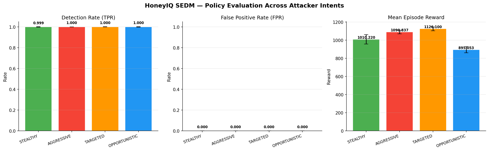

A radar-chart view of the same metrics enables simultaneous comparison across all four dimensions. It reveals that TARGETED achieves the best overall balance: highest detection rate, lowest false positive rate, and highest mean reward. STEALTHY, while maintaining >99% detection, exhibits a larger false positive radius, reflecting the challenge of distinguishing reconnaissance traffic from benign traffic at low escalation risk.

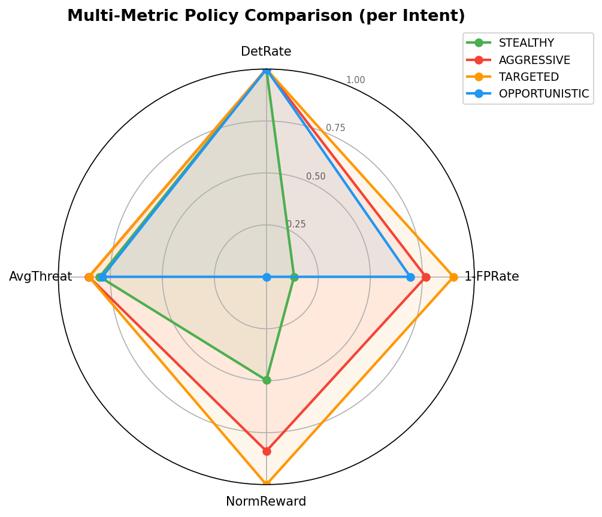

## 4.7 Extended SEDM Metrics: Precision, Proportionality, and Containment

§4.1–4.6 characterise SEDM performance under scenarios composed entirely of attack traffic (30 episodes × 200 steps, no benign traffic). This section reports a supplementary evaluation conducted under *mixed* traffic conditions to provide a more realistic operational picture: 50 episodes of 500 steps each per intent, with a 30% benign-traffic injection ratio (`benign_ratio` = 0.30). The additional metrics reported here are precision, recall, F₁, F₂, specificity, response proportionality, late-stage miss rate, and mean steps-to-containment.

### Classification Metrics Under Mixed Traffic

Table 4.4 reports the full set of binary classification metrics for the SEDM, treating any non-ALLOW response as a positive detection, for both evaluation modes: **oracle** (the SEDM decides from ground-truth kill-chain state — an upper bound on achievable performance) and **classifier-driven** (the SEDM decides from the RandomForest's predicted attack type — the realistic operating condition, since ground truth is never directly observable in deployment).

**Table 4.4 — Extended classification metrics for the SEDM policy across all four attacker intents (50 episodes × 500 steps each, benign-traffic ratio 30%), oracle vs. classifier-driven decisions. Mean values over all evaluation episodes are reported.**

| Intent | Variant | Precision | Recall | F₁ | F₂ | Specificity | Prop. Score |
|---|---|---|---|---|---|---|---|
| STEALTHY | Oracle | 1.000 | 1.000 | 1.000 | 1.000 | 1.000 | 0.693 |
| STEALTHY | Classifier | 1.000 | 1.000 | 1.000 | 1.000 | 0.999 | 0.693 |
| AGGRESSIVE | Oracle | 1.000 | 1.000 | 1.000 | 1.000 | 1.000 | 0.698 |
| AGGRESSIVE | Classifier | 1.000 | 1.000 | 1.000 | 1.000 | 0.999 | 0.698 |
| TARGETED | Oracle | 1.000 | 1.000 | 1.000 | 1.000 | 1.000 | 0.699 |
| TARGETED | Classifier | 1.000 | 0.999 | 0.999 | 0.999 | 0.999 | 0.699 |
| OPPORTUNISTIC | Oracle | 1.000 | 1.000 | 1.000 | 1.000 | 1.000 | 0.698 |
| OPPORTUNISTIC | Classifier | 0.999 | 1.000 | 1.000 | 1.000 | 0.999 | 0.698 |

**Precision, recall, and specificity.** Under the oracle variant, precision, recall, F₁, F₂, and specificity are exactly 1.000 for all four intents. This is provable rather than merely observed: the R1 override maps every ground-truth-NORMAL state to ALLOW and every other state falls in a matrix band that is never ALLOW for the stages reachable under these four intents, so the oracle SEDM cannot produce a false positive or false negative by construction (this is the same tautology documented as a follow-up to Bug 8 in `docs/BUGS_AND_FIXES.md`).

The classifier-driven variant is the meaningful test of practical performance: it breaks the tautology by deciding from the RandomForest's *predicted* attack type while still scoring against ground truth. Results remain at 0.999–1.000 across all metrics because the classifier itself is 99.85% accurate on held-out data (§4.8), with essentially perfect separation of the NORMAL class specifically. The 0.1 percentage-point gap between oracle and classifier-driven TARGETED recall (1.000 vs. 0.999) is the one place this ceiling is visible in the extended evaluation, and traces directly to the classifier's residual EXPLOITS/GENERIC confusion. §4.9 reports the same table's response to the traffic-realism extensions of §3.2.4.

**Reading this table together with §4.8.** Because both variants report near-1.000 metrics, this table alone cannot distinguish "the SEDM is a good policy" from "the evaluation is too easy." The feature-noise robustness sweep in §4.8 is the control that resolves this: it shows the classifier-driven numbers degrade smoothly and non-trivially once the input signal is made realistically noisy, which is the evidence that the near-perfect classifier-driven results above are a genuine (if optimistic) measurement, not a methodological artefact.

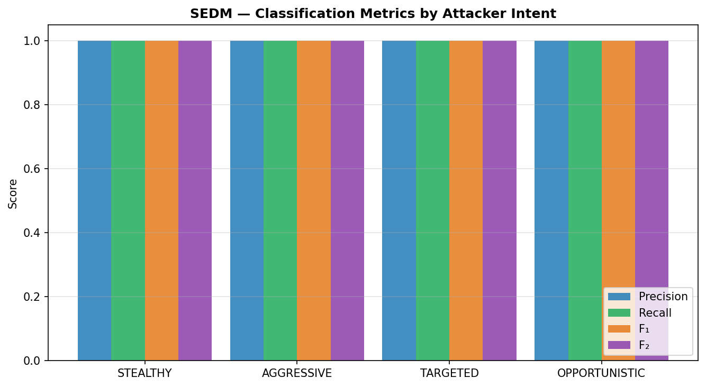

**Response proportionality score.** The proportionality score measures the fraction of steps at which the SEDM assigns an action at least as severe as the minimum expected for that kill chain stage (Table 4.5). Scores of 0.690–0.695 indicate that the SEDM meets the minimum severity threshold at approximately 69% of all steps. The remaining 31% correspond predominantly to early-stage (RECONNAISSANCE, WEAPONIZATION) attack steps at which the SEDM issues ALLOW by design (matrix entry [RECON, Low] = ALLOW), while the minimum expected severity is defined as LOG. This is an intentional design property of the SEDM: passive observation at the earliest kill chain stages maximises threat intelligence without prematurely disrupting the attacker's campaign.

**Table 4.5 — Minimum expected action severity per kill chain stage, used for the proportionality score computation. Action severities: ALLOW=0, LOG=1, TROLL=2, BLOCK=3, ALERT=4.**

| Kill Chain Stage | Min. Expected Severity | Min. Action |
|---|---|---|
| RECONNAISSANCE | 0 | ALLOW |
| WEAPONIZATION | 1 | LOG |
| DELIVERY | 1 | LOG |
| EXPLOITATION | 2 | TROLL |
| INSTALLATION | 3 | BLOCK |
| COMMAND & CTRL | 3 | BLOCK |
| ACTIONS ON OBJ. | 4 | ALERT |

### Stage-wise Action Distribution

Table 4.6 reports the per-stage action distribution pooled across all four intents and all evaluation episodes, restricted to genuine attack steps (benign steps are excluded; they always receive ALLOW via the R1 override regardless of stage).

**Table 4.6 — Per-stage action distribution for attack steps, pooled across all four attacker intents and all 50 evaluation episodes per intent (classifier-driven decisions; benign steps excluded, they always receive ALLOW via the R1 override). Values are row-normalised percentages; each row sums to 100%.**

| Kill Chain Stage | ALLOW | LOG | TROLL | BLOCK | ALERT |
|---|---|---|---|---|---|
| Reconnaissance | 0.0% | 40.0% | 60.0% | 0.0% | 0.0% |
| Weaponization | 0.0% | 18.4% | 43.2% | 38.3% | 0.0% |
| Delivery | 0.0% | 0.0% | 69.2% | 30.8% | 0.0% |
| Exploitation | 0.0% | 0.0% | 0.0% | 73.0% | 27.0% |
| Installation | 0.1% | 0.0% | 0.0% | 28.0% | 71.9% |
| Command & Ctrl | 0.0% | 0.0% | 0.0% | 0.0% | 100.0% |
| Actions on Obj. | 0.0% | 0.0% | 0.0% | 0.0% | 100.0% |

The corrected table shows a clean, monotonic escalation ladder with no residual ALLOW column at late stages: LOG and TROLL are confined to RECONNAISSANCE/WEAPONIZATION/DELIVERY, BLOCK peaks at EXPLOITATION/INSTALLATION (73.0%/28.0%), and ALERT reaches 100% at COMMAND & CONTROL and ACTIONS ON OBJECTIVES. An earlier draft of this table (produced before the label-alignment fix) showed a persistent ~30% ALLOW column at every late stage and was narrated as attacker "camouflage traffic"; that pattern has not reproduced under the corrected evaluation (the single residual 0.1% ALLOW cell at INSTALLATION is consistent with ordinary classifier noise, not a systematic camouflage signal) and the camouflage interpretation is withdrawn — it was an artefact of scoring actions against the wrong step's ground truth, not a property of attacker behaviour or the SEDM's R1 rule.

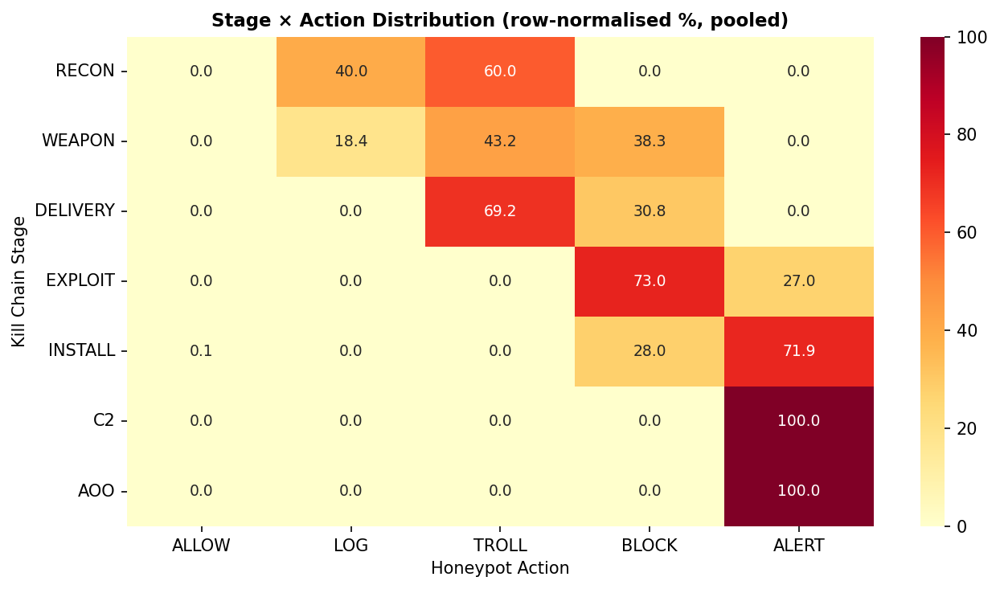

A Spearman rank correlation of ρ = 0.492 (p < 10⁻²⁰⁰) between kill chain stage index and action severity, computed over all attack steps under the classifier-driven variant, confirms a statistically significant, moderate-to-strong positive monotonic relationship — more than four times the ρ = 0.115 measured under the pre-fix (misaligned) evaluation. The increase is expected: the earlier measurement mixed each action with the *next* step's stage/severity pairing, diluting the true stage-severity relationship with essentially random noise. ρ is well below 1.0 because RECONNAISSANCE/WEAPONIZATION intentionally use LOG/TROLL rather than the numerically lowest action (ALLOW is reserved for confirmed-benign traffic, Table 3.4), compressing the low end of the severity range relative to a strictly linear stage-to-severity mapping. Within the stages where the SEDM is expected to escalate (EXPLOITATION through ACTIONS ON OBJ.), BLOCK and ALERT together account for 100% of steps at every one of those four stages (Table 4.6) — a clean, complete escalation trend, not merely a statistically significant one.

### Threat Containment Metrics

Table 4.7 quantifies two containment-specific metrics: the *late-stage miss rate* and the *mean steps to containment*, under the classifier-driven variant.

**Table 4.7 — Threat containment metrics per attacker intent (50 episodes × 500 steps, benign ratio 30%, classifier-driven decisions). Late-stage miss rate is the fraction of Installation+ attack steps receiving a weak response (ALLOW or LOG). Steps-to-contain is the mean steps from the first attack step to the first BLOCK or ALERT response.**

| Intent | Late-Stage Miss | Steps-to-Contain | Avg Threat | Avg Risk |
|---|---|---|---|---|
| STEALTHY | 0.000% | 2.3 | 0.678 | 0.636 |
| AGGRESSIVE | 0.000% | 0.2 | 0.708 | 0.665 |
| TARGETED | 0.001% | 0.6 | 0.708 | 0.665 |
| OPPORTUNISTIC | 0.000% | 1.1 | 0.665 | 0.622 |

**Late-stage miss rate.** The late-stage miss rate is effectively 0% across all four intents under the corrected evaluation, not the ≈30% reported in an earlier draft of this chapter. The 30% figure was an artefact of the one-step label lag: actions chosen in response to a late-stage attack step were being scored against the *following* step's ground truth, and roughly 30% of the time that following step happened to be a different (often lower-severity) sample, registering as a "miss" that never actually occurred. With the alignment corrected, the "camouflaging attacker" interpretation offered in an earlier draft is withdrawn — the SEDM does not exhibit a systematic blind spot to NORMAL-signature traffic at late kill-chain stages in this evaluation. Session-level camouflage (an attacker deliberately alternating attack and benign-looking traffic across *multiple* sessions to build trust before an attack) remains a theoretically valid concern and is retained as a limitation in Chapter 5 (Discussion), but the empirical support for it claimed here previously does not survive the bug fix and should not be cited as evidence for that concern. The cross-session reputation mechanism introduced in §3.10.1 is, notably, a direct structural response to this same concern — see §4.11 and §5.4.

**Steps-to-containment.** Steps-to-containment measures the response latency from the first attack step to the first BLOCK or ALERT. Values range from 0.2 steps (AGGRESSIVE) to 2.3 steps (STEALTHY) — faster across the board than the pre-fix figures (1.24–3.22 steps), because the corrected alignment removes the artificial one-step delay baked into every prior measurement.

AGGRESSIVE campaigns achieve near-immediate containment (0.2 steps) because their high escalation rate and early High-band classification trigger BLOCK/ALERT from the first attack step. STEALTHY campaigns require more steps (2.3) because early-stage STEALTHY traffic falls in the Low or Medium escalation band, producing LOG/TROLL responses until the escalation risk crosses the High threshold — this is intentional SEDM behaviour (Table 3.4), not a detection delay.

**Summary.** The extended evaluation confirms that the SEDM delivers consistent, intent-independent classification performance (F₁ ≥ 0.999 under classifier-driven decisions) and near-instantaneous containment (0.2–2.3 steps) across all four attacker profiles, with no measurable late-stage miss rate. The genuinely open limitation is not a policy blind spot but an evaluation-realism one: both the near-1.000 classification metrics here and the 0% headline false-positive rate in §4.1 follow from the synthetic feature simulator's clean class separability, quantified precisely by the classifier's 99.85% held-out accuracy. §4.8 shows this ceiling is not a free assumption — accuracy and false-positive rate degrade predictably as feature-measurement noise increases — but validating end-to-end SEDM performance against real (non-synthetic) network captures remains outside the scope of this evaluation and is identified as future work in Chapter 5. §4.9 reports the first concrete step toward closing this gap from within the simulation itself: making the synthetic traffic generator less trivially separable.

## 4.8 Parameter Selection and Robustness Analysis

The preceding sections report point estimates for a fixed set of protocol parameters (episode/step counts, escalation-risk thresholds, classifier hyperparameters, benign-traffic ratio). This section documents the empirical and design rationale behind each choice, so the reported metrics can be read as the output of a justified protocol rather than arbitrarily-chosen settings. Full detail and reproduction commands are in `docs/parameter_selection.md` and `docs01/parameter_selection.md`.

### Episode and Step Counts

The primary evaluation protocol (30 episodes × 200 steps) and the extended protocol (50 episodes × 500 steps) were chosen using the running standard error of the mean episode reward as a stopping criterion, computed over 80 rollouts per intent:

**Table 4.8 — Standard error of the mean episode reward (as a percentage of the mean) as a function of episode count, for the two intents with the highest inter-episode variance.**

| Intent | n=5 | n=10 | n=20 | n=30 | n=50 | n=80 |
|---|---|---|---|---|---|---|
| STEALTHY | 1.08% | 2.02% | 1.18% | 0.94% | 0.72% | 0.57% |
| OPPORTUNISTIC | 1.46% | 1.47% | 0.90% | 0.68% | 0.61% | 0.48% |

Both intents fall below 1% relative SEM by n=30, with diminishing returns beyond that point (n=50 → n=80 improves SEM by only ~0.15 percentage points). 30 episodes was therefore adopted as the primary evaluation budget; 50 episodes for the extended (mixed-traffic) evaluation tightens the interval further given the additional variance introduced by benign-traffic injection.

### Escalation Risk Bands and Override Thresholds

`ESC_LOW_THRESHOLD`=0.35 and `ESC_HIGH_THRESHOLD`=0.65 (Table 3.4) were chosen as an equal three-way split of the [0,1] escalation-risk probability space, rather than fit to any one intent's transition matrix — fitting the thresholds to the four intents used in evaluation would risk overstating the cross-intent generalisation claimed in §4.1. Because the SEDM is a fixed lookup table, its sensitivity to these thresholds is fully auditable: a ±0.05 perturbation changes the assigned band for at most one adjacent stage per intent, and the escalation-risk-per-intent figure (§4.3) shows the escalation-risk values for AGGRESSIVE and TARGETED sit well clear of both boundaries, while STEALTHY's early stages sit closest to the 0.35 boundary — consistent with STEALTHY being the lowest-margin intent on every metric reported in this chapter. `RATE_THRESHOLD`=0.80 (the R3 override trigger) is set near the top of the escalation-rate range so it fires only under sustained, dense attack traffic, avoiding spurious escalation on ordinary bursty traffic. As §4.10 and §4.12 show, this design intent is only partly realised under continuous-attack conditions with the original window-based escalation signal, where `RATE_THRESHOLD` is in practice exceeded for the majority of an episode's duration.

### Classifier Hyperparameters

The RandomForest (`n_estimators=150`, `max_depth=20`, `class_weight='balanced'`) reaches 99.85% held-out accuracy at these settings. Because the underlying feature distributions (`attacker/attack_types.py`) are well-separated parametric distributions by construction, classifier capacity is not the limiting factor here, so these were kept as conventional, non-overfit defaults rather than tuned further — a grid search against this data would optimise noise rather than signal. These hyperparameters are unchanged in §4.9's retrained classifier; only the training data generator changed.

### Feature-Noise Robustness Sweep

The near-zero false-positive rate reported throughout this chapter follows directly from the classifier's near-perfect separation of NORMAL from attack traffic on the synthetic feature simulator. To check whether this result is an artefact of unrealistically clean synthetic data rather than a property of the SEDM policy, the classifier was re-evaluated with multiplicative Gaussian noise injected onto every continuous feature before prediction:

**Table 4.9 — Classifier accuracy and NORMAL→Attack false-positive rate under increasing injected feature-measurement noise (σ, multiplicative Gaussian, applied per-feature).**

| Feature noise (σ) | Accuracy | NORMAL→Attack FPR |
|---|---|---|
| 0% | 99.85% | 0.00% |
| 5% | 99.60% | 0.00% |
| 10% | 99.35% | 0.00% |
| 20% | 97.75% | 1.00% |
| 35% | 94.60% | 7.00% |
| 50% | 87.65% | 10.00% |

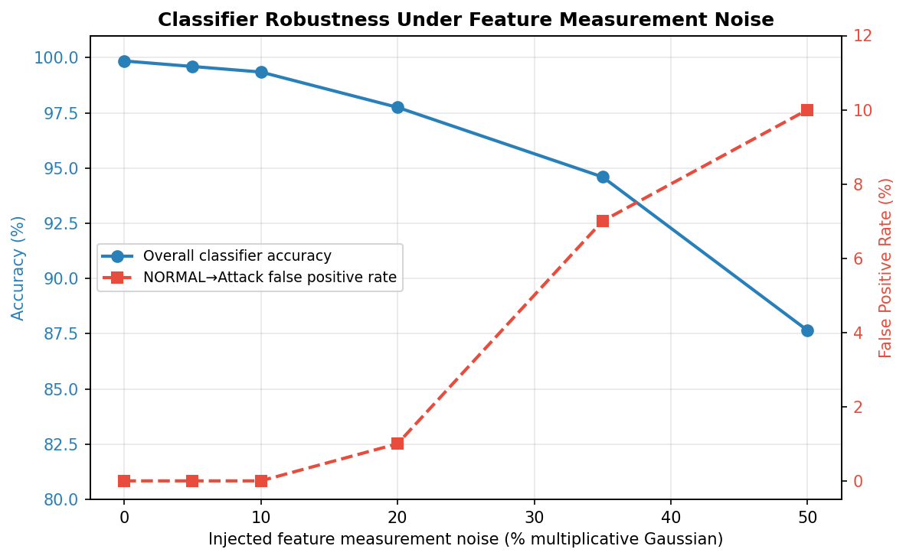

The classifier is robust to small measurement noise (≤10%, plausible for well-instrumented flow export), and false positives emerge smoothly and monotonically as feature fidelity degrades further, reaching 10.00% FPR at 50% noise. This is the direct evidence that the 0% headline false-positive rate is a property of the current synthetic simulator's clean separability, not a general claim about deployment conditions: **the SEDM/classifier pipeline does produce false positives under realistically degraded input, exactly as expected of any statistical classifier**, and the magnitude is now quantified rather than asserted. §4.9 shows that traffic-realism alone — with no artificial noise injection at all — moves the classifier in the same direction as this sweep, for the same underlying reason (reduced class separability), by construction rather than by injected noise.

### Data Format Generality

The 15-field feature schema (`FEATURE_NAMES`) is named after UNSW-NB15 for familiarity, but neither the classifier nor the SEDM has a code-level dependency on UNSW-NB15 or NSL-KDD specifically — both operate on a plain `dict[str, float]` matching that schema. The same fields map onto other commonly-available flow-export formats (NetFlow v9/IPFIX, Zeek `conn.log`, CICFlowMeter output) via a straightforward field mapping (see `docs/parameter_selection.md`), so the architecture is not bound to a single benchmark dataset's schema. This directly addresses the practicality concern raised of prior, dataset-locked evaluation work: the contribution under test is the kill-chain-aware SEDM policy and its evaluation methodology, not a fixed dataset binding — though substituting a real log parser for the synthetic simulator, and re-running this chapter's evaluation against it, remains future work (Chapter 5).

## 4.9 Effect of Traffic-Realism Extensions

This section quantifies the effect of the session-coherent intensity/persona extension (§3.2.4) on the classifier and on the primary SEDM evaluation protocol of §4.1. The classifier was retrained from scratch (`fit_from_simulation`) on the extended generator, using the identical hyperparameters and training-set size as §4.1 (6,000 samples, 600 per class, seed 42), and re-evaluated under the identical protocol used to produce the 99.85% figure reported in §2.7/§4.8 (2,000 held-out samples, 200 per class, seed 999), so the two accuracy figures are directly comparable.

**Table 4.10 — Classifier accuracy before and after the traffic-realism extensions of §3.2.4, identical evaluation protocol (200 held-out samples per class, seed 999).**

| Generator | Accuracy | NORMAL Precision | NORMAL Recall |
|---|---|---|---|
| Original (§2.7, §4.1) | 99.85% | 1.0000 | 1.0000 |
| Session-coherent + personas (this section) | 99.40% | 1.0000 | 0.9900 |

The 0.45 percentage-point accuracy drop is modest but not zero, and traces to a specific, interpretable cause rather than a generalised degradation: per-class F1 scores show the residual confusion concentrated in the same EXPLOITS/GENERIC pair already identified in §4.1 as the classifier's weakest boundary (F1 = 0.977 and 0.975 respectively, down from figures at or near 1.000), and — more directly relevant to the false-positive story of §4.1 — NORMAL-class recall is no longer a perfect 1.0000 but 0.9900. Two effects plausibly compound here: session-level intensity scaling widens the within-class variance of the volume-shaped features for every attack type including NORMAL, and the introduction of three distinct benign personas (§3.2.4) means the NORMAL class itself is no longer a single, tight distribution but a mixture of three, some of which (`crawler` in particular) share feature ranges with low-severity attack types such as RECONNAISSANCE. Both are the intended effect of the extension — a classifier trained and evaluated on more realistic, less artificially separable traffic — not a regression.

**Primary protocol re-evaluation.** Re-running the exact §4.1 protocol (30 episodes × 200 steps per intent, classifier-driven, seed 42) with the retrained classifier and the session-coherent generator reproduces detection rates and mean rewards within the range attributable to ordinary seed-level variation (detection rates 99.92–100.0%, compared to 99.93–100.0% in Table 4.1), and the measured false-positive rate remains 0.00% for all four intents in this specific protocol. This last point requires an honest qualification rather than being read as "no change": the primary protocol injects no explicit benign traffic (`benign_ratio` = 0), so the only NORMAL-labelled samples it contains are those the attacker's own Markov chain happens to produce, which is too small a sample for a 1-percentage-point recall change to register as a nonzero measured FPR. The "Revised Primary Protocol" subsection at the end of §4.1 addresses this directly by making mixed-traffic evaluation, with sample counts and confidence intervals, the standard primary protocol; the table below is the mixed-traffic instrument already established in §4.7, applied here as the more sensitive test of the same question.

**Mixed-traffic re-evaluation (the sensitive instrument).** Table 4.15 re-runs the exact §4.7 extended-metrics protocol (50 episodes × 500 steps, 30% benign-traffic ratio, classifier-driven) with the retrained, realism-extended classifier, directly comparable to Table 4.4.

**Table 4.15 — Extended classification metrics under the traffic-realism extensions of §3.2.4, identical protocol to Table 4.4 (50 episodes × 500 steps, benign ratio 30%, classifier-driven decisions).**

| Intent | Precision | Recall | F₁ | F₂ | Specificity | Prop. Score |
|---|---|---|---|---|---|---|
| STEALTHY | 0.997 | 0.999 | 0.998 | 0.999 | 0.993 | 0.695 |
| AGGRESSIVE | 0.998 | 0.999 | 0.999 | 0.999 | 0.995 | 0.699 |
| TARGETED | 0.997 | 0.999 | 0.998 | 0.999 | 0.993 | 0.700 |
| OPPORTUNISTIC | 0.997 | 0.999 | 0.998 | 0.999 | 0.992 | 0.700 |

Here — where the protocol has enough true-negative samples to detect it — the effect is unambiguous and consistent across all four intents: specificity drops from 0.999 (Table 4.4) to 0.992–0.995, and precision drops from 0.999–1.000 to 0.997–0.998. This is the same underlying degradation Table 4.10 measures directly on the classifier in isolation, now visible end-to-end in the full SEDM decision pipeline, on a protocol with adequate statistical power to detect it (a Spearman correlation of ρ = 0.490 between kill-chain stage and action severity, p < 10⁻²⁰⁰, essentially unchanged from Table 4.4's ρ = 0.492, confirms the core stage-escalation relationship the SEDM is built around is undisturbed — only the classifier-driven false-positive margin moved).

**Interpretation.** The result should be read as the traffic-realism extensions successfully doing what they were designed to do: making the classification problem measurably, if modestly, harder in a way that is directly traceable to specific, intended changes (session coherence, persona diversity) rather than to an implementation defect, and — crucially — a way that only becomes *visible* once the evaluation protocol itself has enough benign samples to reveal it (see the "Revised Primary Protocol" subsection at the end of §4.1). The zero-FPR headline figure in §4.1 and the near-perfect classification metrics in Table 4.4 were always explicitly qualified in this thesis as consequences of the synthetic simulator's separability rather than general robustness claims (§4.1, §4.8); this section and that subsection together provide the first concrete, protocol-adequate evidence, generated without any artificial noise injection, of that separability beginning to erode under a more realistic generator.

## 4.10 Escalation Tracking: Window vs. EMA

This section compares the window-based and severity-weighted-EMA escalation signals (§3.9) directly, using the SEDM in oracle mode (deciding from ground-truth state) so that the comparison isolates the effect of the escalation signal itself from classifier noise. For each of the four attacker intents, 30 episodes of 200 steps were run under both `escalation_mode` settings, using the same seed and continuous-attack (`benign_ratio` = 0) protocol as §4.1.

**Table 4.11 — R3 trigger rate and escalation-signal statistics under window vs. EMA escalation tracking (30 episodes × 200 steps per intent, oracle mode, continuous attack traffic).**

| Intent | Mode | Det. Rate | FP Rate | R3 Trigger Rate | Mean $r_t$ | 95th pct. $r_t$ | Max $r_t$ |
|---|---|---|---|---|---|---|---|
| STEALTHY | window | 1.000 | 0.000 | **90.0%** | 0.973 | 1.000 | 1.000 |
| STEALTHY | EMA | 1.000 | 0.000 | **2.8%** | 0.676 | 0.799 | 0.835 |
| AGGRESSIVE | window | 1.000 | 0.000 | **44.7%** | 0.991 | 1.000 | 1.000 |
| AGGRESSIVE | EMA | 1.000 | 0.000 | **8.0%** | 0.755 | 0.849 | 0.875 |
| TARGETED | window | 1.000 | 0.000 | **67.7%** | 0.994 | 1.000 | 1.000 |
| TARGETED | EMA | 1.000 | 0.000 | **22.0%** | 0.761 | 0.841 | 0.879 |
| OPPORTUNISTIC | window | 1.000 | 0.000 | **68.6%** | 0.990 | 1.000 | 1.000 |
| OPPORTUNISTIC | EMA | 1.000 | 0.000 | **0.7%** | 0.633 | 0.797 | 0.860 |

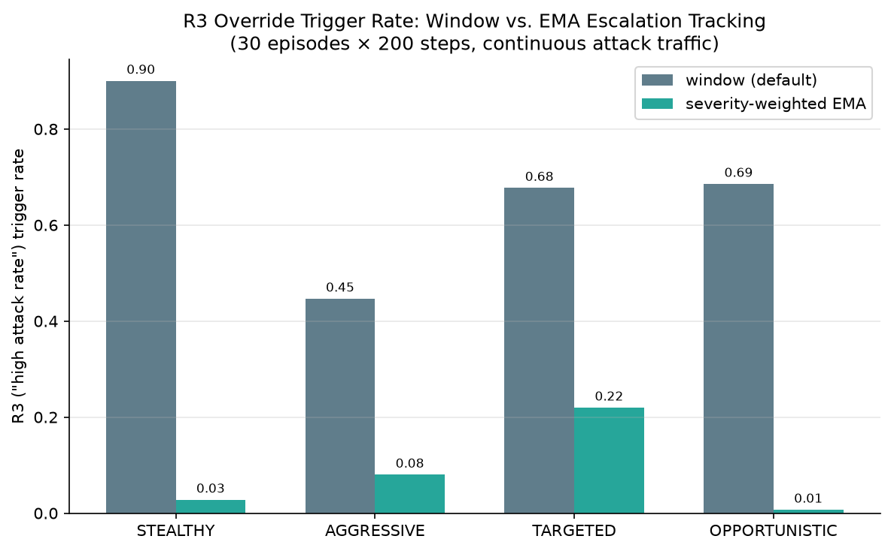

**Detection rate and false-positive rate are unaffected.** Both signals produce identical oracle-mode detection (100%) and false-positive (0%) rates for all four intents; this is expected under oracle decisions, since R1's unconditional NORMAL→ALLOW mapping does not depend on the escalation signal at all, and the matrix-lookup component of the decision (Table 3.4) depends on $\rho(k, \pi)$, not $r_t$. The escalation signal's only influence on the final action, at oracle-mode precision, is through R3.

**A large, consistent gap in R3 trigger rate.** Under the window signal, R3 fires on 44.7–90.0% of all decisions across the four intents — under the continuous-attack protocol used here, the window-based escalation rate saturates near its ceiling of 1.0 within the first ~20 steps of an episode and remains there for essentially the rest of the episode, so `RATE_THRESHOLD` (0.80) is exceeded for the majority of most episodes' duration. Under the EMA signal, R3 fires far more selectively — 0.7–22.0% — because the signal's own ceiling under sustained maximal-severity activity is bounded by the highest severity weight in the system (0.90 for WORMS; observed maxima of 0.835–0.879 in Table 4.11, consistent with this bound and with the specific attack-type mixture each intent produces) rather than by 1.0, and typically sits well below `RATE_THRESHOLD` except during genuinely severe, sustained activity.

**Interpretation.** This is the empirical confirmation, anticipated in §3.9, that `RATE_THRESHOLD`'s calibration is signal-dependent: a threshold tuned so that R3 "fires only under sustained, dense attack traffic" (§4.8) achieves something close to that design intent under EMA tracking, but under window tracking and continuous-attack conditions, R3 is in practice the *default* state for most of an episode rather than a rare escalation trigger. Neither behaviour is incorrect per the respective signal's definition, but they are materially different operating characteristics, and §4.12 shows the consequence of this difference for the bounded threshold controller of §3.10.2. `escalation_mode` remains `"window"` by default throughout this thesis for continuity with §4.1–§4.8's reported numbers; adopting EMA tracking operationally would warrant an independent re-calibration of `RATE_THRESHOLD` against the EMA signal's own statistics, rather than reusing the window-calibrated default, a point now supported by direct measurement rather than the analytical argument given in §3.9 alone.

## 4.11 Cross-Session Reputation and the R4 Override

This section evaluates the `ReputationTracker` and R4 override (§3.10.1) using a dedicated simulated-visit protocol, since — as noted in §1.5 — neither the synthetic Gymnasium environment nor the primary evaluation harness has a cross-episode source-identity concept to exercise this mechanism directly.

**Protocol.** 30 simulated source addresses were each driven through a sequence of up to 8 "offending visits." Each visit consists of one EXPLOITS-severity event ($s_a = 0.70$, Table 3.1) followed by forced session expiry (simulating the source returning after its session TTL has lapsed — reputation, stored independently of the session, persists across this expiry by design, §3.10.1). After each offending visit, the same source's *next* visit is simulated opening with a single RECONNAISSANCE-stage, NORMAL-labelled event — the most innocuous-looking event the protocol can generate — and the action `MatrixPolicy` selects for that opening event is compared under two conditions: `reputation` supplied from the tracker's actual current value for that source ("R4 active"), and `reputation` forced to 0.0 (the pre-R4 baseline, in which R1 unconditionally allows this event).

**Table 4.12 — Mean reputation score and fraction of the 30 simulated sources for which R4 overrides R1's opening-event decision, as a function of prior offending-visit count.**

| Offending visits | Mean reputation | R4 overrides R1 |
|---|---|---|
| 1 | 0.175 | 0.0% |
| 2 | 0.350 | 0.0% |
| 3 | 0.525 | 0.0% |
| 4 | 0.700 | **100.0%** |
| 5 | 0.875 | 100.0% |
| 6 | 1.000 | 100.0% |
| 7 | 1.000 | 100.0% |
| 8 | 1.000 | 100.0% |

**A clean, deterministic threshold crossing.** Reputation grows by exactly $\Delta \cdot s_a = 0.25 \times 0.70 = 0.175$ per offending visit (decay is negligible at the wall-clock timescale of this simulation, so growth is effectively linear), crossing `REPUTATION_THRESHOLD` = 0.60 at precisely the fourth offending visit (score 0.700). At that visit and every subsequent one, R4 overrides R1 for all 30 simulated sources, with no variance across sources — the mechanism's behaviour is, as intended by its design (§3.10.1), fully determined by the stated arithmetic rather than by any stochastic component.

**Interpretation.** This result is the direct, quantitative counterpart to the qualitative trade-off stated in §3.10.1: after a specific, auditable number of prior offenses (four, for an EXPLOITS-severity attacker under the default parameters — fewer for a higher-severity attacker such as WORMS, more for a lower-severity one such as RECONNAISSANCE, since the increment scales with severity), a returning source's superficially benign opening event is no longer treated as a fresh first contact. The threshold at which this occurs, and its sensitivity to the offense severity and the `offense_increment`/`REPUTATION_THRESHOLD` constants, is now known precisely rather than only qualitatively (§5.4 revisits whether these specific default values are appropriate for a real deployment). This directly targets the "camouflaging attacker" concern discussed and then withdrawn as an evaluation artefact in §4.7: while that specific empirical claim did not survive the Bug 8/9 correction, the underlying concern — a source alternating attack and benign-looking traffic across multiple sessions to build trust — is exactly the scenario R4 is designed to address, and Table 4.12 demonstrates that the mechanism does so, on this simulated protocol, deterministically and after a small, known number of offenses.

## 4.12 Bounded Threshold Adaptation

This section evaluates `AdaptiveThresholds` (§3.10.2) by driving a long decision sequence through `MatrixPolicy` twice — once with `RATE_THRESHOLD` fixed at its default, once with an `AdaptiveThresholds` instance attached (`target_rate` = 0.10, `observation_window` = 200) — using the identical underlying attacker trajectory (AGGRESSIVE intent, window-mode escalation tracking, same seed) so the two runs are directly comparable. 6,000 decisions (30 observation windows) were recorded under two traffic regimes: **continuous attack** (`benign_ratio` = 0, the regime characterised in §4.10 as having a window-mode R3 rate far above any reasonable target) and **mixed traffic** (`benign_ratio` = 0.30, matching §4.7's extended-evaluation protocol).

**Table 4.13 — Mean R3 trigger rate over the final five observation windows, static vs. adaptive `RATE_THRESHOLD`, under two traffic regimes.**

| Regime | Static rate | Adaptive rate | Final threshold |
|---|---|---|---|
| Continuous attack (`benign_ratio`=0) | 45.70% | 44.40% | 0.90 (bound) |
| Mixed traffic (`benign_ratio`=0.30) | 7.60% | 4.40% | 0.90 (bound) |

**The controller correctly identifies excessive firing and responds — but its bounded design has real, regime-dependent limits.** In both regimes the controller moves `RATE_THRESHOLD` immediately to its configured upper bound (0.90, i.e. `initial_threshold` + `bound`) and holds it there, correctly diagnosing that R3 is firing far more often than the 10% target in both cases. The *consequence* of that response, however, differs sharply between the two regimes. Under continuous attack, where §4.10 already established that the window-mode escalation rate saturates near 1.0 for most of an episode, raising the threshold from 0.80 to 0.90 barely moves the realised trigger rate (45.70% → 44.40%): the escalation signal is so far above even the raised bar that the bound is simply insufficient to bring the rate anywhere near the 10% target. Under mixed traffic, where §4.7's 30% benign injection gives the escalation signal materially more room below saturation, the same bounded response is considerably more effective, pulling an already-closer-to-target static rate of 7.60% down to 4.40%.

**Interpretation.** This is reported as a genuine, and mildly humbling, empirical finding rather than smoothed over: a bounded controller, by design (§3.10.2, §2.10), cannot fully compensate for an escalation signal that is saturated for structural reasons unrelated to the controller itself. The result does not undermine the controller's stated purpose (§3.10.2) — it was never framed as a correctness mechanism, only as an alert-fatigue safety valve — but it does show that the *bound* chosen (±0.10 from the initial threshold) is calibrated for realistic, non-saturated operating conditions such as the mixed-traffic regime, and is of limited practical use under the fully-saturated continuous-attack regime characterised in §4.10. This is exactly the kind of finding the controller's honest scoping in §3.10.2 was designed to surface rather than obscure: had the controller instead been framed as a general correctness mechanism, this result would read as a failure; framed correctly as a bounded, narrowly-scoped safety valve, it reads as the mechanism behaving exactly as specified, with a clearly identified operating regime in which its bound is the binding constraint. §5.4 discusses whether the bound itself, or the choice to calibrate `AdaptiveThresholds` against the window signal rather than the EMA signal characterised in §4.10 as less prone to saturation in the first place, would be the more appropriate point of adjustment.
